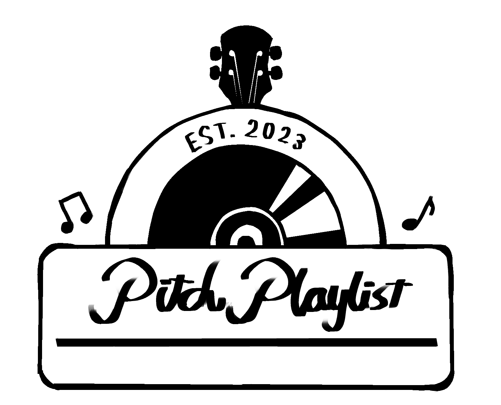

# PitchPlaylist

## [See the App!](https://pitchplaylist.adaptable.app)



## Description


 
## User Stories

- The user is able to log in and log out with ease in the click of a button!
- The user can create playlists with their favorite artists 
- The user has their own profile which can be slightly customized with a profile picture
- The user can delete their playlists or remove artists from them at their leisure 
- The user is able to see the playlists created by other users and see what they like!
## Backlog Functionalities

- a comments section for the playlists so the users can share their experiences
- Add spotify compatability so you can check some of the songs made by the artists

## Technologies used

- HTML 
- CSS 
- Javascript 
- Node 
- Express 
- Handlebars 
- Sessions 
- mongoose
- cloudinary
- bcrypt 


## Models


Artist model
 
```
name: String
yearBorn: Number
description: String
photo: String
```

Playlist model

```
creator: ObjectId<User>
title: String
artist: ObjectId<Artist>
info: String 
``` 

User model

```
username: String
email: String
password: String
photoUrl: String
role : String ["user", "admin"]


```

## Links

## Collaborators

[Alejandro.R](https://github.com/AlejandroRodriguezOjeda)

[Anna.K](https://github.com/drannakurasova)

### Project

[Repository Link](https://github.com/AlejandroRodriguezOjeda/PitchPlaylist)

[Deploy Link](https://pitchplaylist.adaptable.app)


### Slides

[Slides Link](https://www.canva.com/design/DAFr4BJxgso/5mw0-pCUcPaYV4drB65TTQ/view?utm_content=DAFr4BJxgso&utm_campaign=designshare&utm_medium=link&utm_source=publishsharelink)